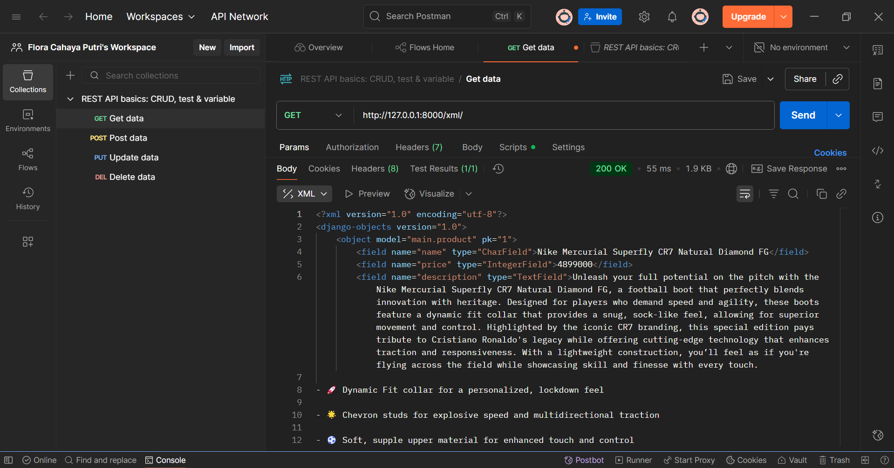
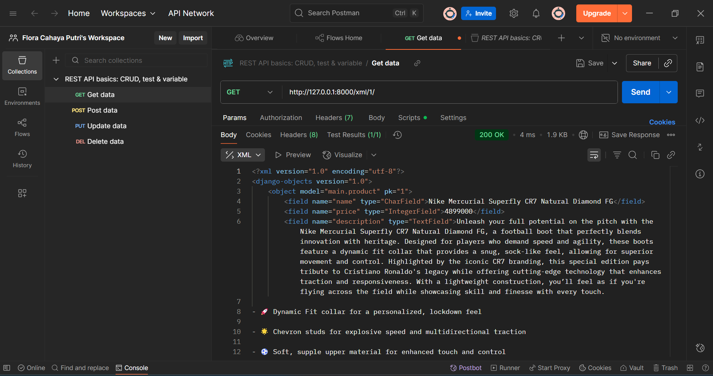
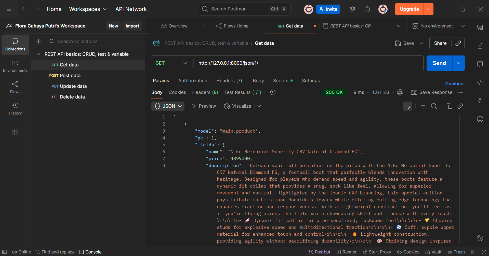

--> TUGAS 2

Membuat sebuah README.md yang berisi tautan menuju aplikasi PWS yang sudah di-deploy, serta jawaban dari beberapa pertanyaan berikut.

- Tautan menuju aplikasi PWS yang sudah di-deploy: https://flora-cahaya-elevenkick.pbp.cs.ui.ac.id/

1. Jelaskan bagaimana cara kamu mengimplementasikan checklist di atas secara step-by-step (bukan hanya sekadar mengikuti tutorial).
Jawab:
1) Pertama, saya membuat direktori bernama elevenkick, lalu membuat dan mengaktifkan virtual environment dengan perintah python -m venv env dan env\Scripts\activate. Setelah itu, saya menyiapkan file requirements.txt yang berisi dependencies (seperti Django, gunicorn, whitenoise, psycopg2-binary, dll.) dan menginstalnya menggunakan pip install -r requirements.txt. Selanjutnya, saya membuat proyek Django bernama elevenkick dengan django-admin startproject elevenkick .. Saya juga membuat file .env (untuk database SQLite di lokal) dan .env.prod (untuk PostgreSQL di PWS), lalu menghubungkannya dengan settings.py. Setelah migrasi database dijalankan dan python manage.py runserver berhasil, halaman roket Django tampil di http://localhost:8000/ sebagai tanda proyek berjalan dengan baik.
2) Saya membuat aplikasi baru bernama main dengan python manage.py startapp main, kemudian menambahkannya ke INSTALLED_APPS di settings.py.
3) Di dalam folder main, saya membuat file urls.py yang berisi route ke fungsi show_main.
4) Pada models.py, saya membuat model bernama Product dengan atribut seperti name, price, description, thumbnail, category, dan is_featured, lalu melakukan migrasi database.
5) Di views.py, saya menuliskan fungsi show_main yang mengirim data berupa nama aplikasi, nama saya, dan kelas ke template HTML agar bisa ditampilkan secara dinamis.
6) Pada urls.py di proyek utama, saya menambahkan path('', include('main.urls')), sehingga halaman utama bisadiakses melalui http://localhost:8000/.
7) Untuk deployment ke PWS, saya login dengan SSO, membuat proyek baru, lalu menambahkan environment variables dari .env.prod. Setelah itu, saya memperbarui ALLOWED_HOSTS dengan URL PWS. Terakhir, saya melakukan git add, git commit, dan git push pws master. Jika status sudah Running, maka aplikasi bisadiakses melalui URL PWS yang telah diberikan.

2. Buatlah bagan yang berisi request client ke web aplikasi berbasis Django beserta responnya dan jelaskan pada bagan tersebut kaitan antara urls.py, views.py, models.py, dan berkas html.
Jawab:
- Bagan (canva): https://www.canva.com/design/DAGygUExUm4/11zzEH2XBNxg6ds4s6PHPw/edit?utm_content=DAGygUExUm4&utm_campaign=designshare&utm_medium=link2&utm_source=sharebutton
- Penjelasan: Pada bagan tersebut, urls.py berkaitan dengan views.py, karena mengarahkan request dari pengguna ke fungsi view yang sesuai. Selanjutnya, views.py berkaitan dengan models.py untuk mengambil atau mengolah data dari database. Data yang sudah diproses kemudian dikirim oleh views.py ke HTML (template) agar bisaditampilkan. Terakhir, HTML berkaitan dengan pengguna karena menjadi respons akhir yang tampil di browser. Dengan demikian, urls.py, views.py, models.py, dan HTML saling berkaitan dalam memproses request hingga menghasilkan tampilan web.

3. Jelaskan peran settings.py dalam proyek Django!
Jawab:
settings.py adalah pusat konfigurasi proyek Django. Hampir semua perilaku aplikasi (database, template, static files, keamanan, dll.) dikontrol dari settings.py. Berikut penjelasan fungsi-fungsi utamanya, antara lain:
- Keamanan (SECRET_KEY, DEBUG, ALLOWED_HOSTS) → ngatur kunci rahasia, apakah error detail ditampilkan, dan siapa saja yang boleh akses aplikasi.
- INSTALLED_APPS → daftar aplikasi yang dipakai di project (misalnya main, admin, dll.).
- MIDDLEWARE → lapisan “pengawas” yang ngecek request & response (kayak login session, CSRF, dll.).
- ROOT_URLCONF & WSGI_APPLICATION → ngatur pintu masuk URL ke views dan cara aplikasi dijalankan di server.
- TEMPLATES → ngatur di mana Django cari file HTML buat ditampilkan.
- DATABASES → ngatur database yang dipakai (SQLite di laptop, PostgreSQL di server).
- STATIC_URL → ngatur file statis kayak CSS, JS, gambar.
- Bahasa & waktu (LANGUAGE_CODE, TIME_ZONE) → ngatur bahasa & zona waktu.
- Validasi password & default primary key → ngatur aturan keamanan password dan tipe ID di database.

4. Bagaimana cara kerja migrasi database di Django?
Jawab:
Migrasi database di Django adalah proses untuk nyamain struktur database dengan model yang kita buat di kode Python. Cara kerjanya, yaitu ketika kita buat atau ubah model di models.py, Django mencatat perubahan itu dalam bentuk file migrasi dengan perintah makemigrations. File migrasi ini berisi instruksi bagaimana database harus diubah. Setelah itu, perintah migrate bakal ngejalanin instruksi tersebut ke database, misalnya buat tabel baru, nambah kolom, atau ubah struktur tabel. Django juga simpan riwayat migrasi agar tiap perubahan tercatat dan tidak dijalankan dua kali. Dengan cara ini, kita gaperlu nulis perintah SQL manual, karena Django yang menerjemahkannya ke dalam perubahan di database.

5. Menurut Anda, dari semua framework yang ada, mengapa framework Django dijadikan permulaan pembelajaran pengembangan perangkat lunak?
Jawab:
Django dijadikan permulaan pembelajaran pengembangan perangkat lunak, karena framework ini terstruktur, lengkap, dan “batteries included”. Django sudah menyediakan banyak fitur dasar, seperti autentikasi, manajemen database, dan routing, sehingga kita bisa fokus memahami konsep inti pengembangan perangkat lunak tanpa harus membangun semuanya dari nol. Selain itu, Django menerapkan pola MVC (Model-View-Controller) yang membantu memahami pemisahan logika, data, dan tampilan serta memiliki dokumentasi yang baik.

6. Apakah ada feedback untuk asisten dosen tutorial 1 yang telah kamu kerjakan sebelumnya?
Jawab:
Masih ada beberapa step yang kurang jelas dan terkadang membuat salah paham. Tetapi, secara keseluruhan, sudah bagus dan membantu saya dalam melaksanakan tutorial.

--> TUGAS 3

1. Jelaskan mengapa kita memerlukan data delivery dalam pengimplementasian sebuah platform?
Jawab:
Data delivery adalah proses pengiriman data dari sumber ke tujuan secara cepat, efisien, dan aman, baik melalui batch maupun real-time. Data delivery diperlukan dalam pengimplementasian sebuah platform, karena menjadi tulang punggung komunikasi antar komponen, misalnya antara frontend dan backend atau antar layanan dalam arsitektur microservices. Dengan adanya mekanisme pengiriman data seperti API yang menggunakan format JSON atau XML, platform bisamemastikan pertukaran informasi berjalan konsisten, terstruktur, dan bisadipahami oleh sistem lain. Selain itu, data delivery juga mendukung skalabilitas, menjaga integritas data, serta memungkinkan integrasi dengan layanan eksternal maupun pihak ketiga. Tanpa adanya proses ini, platform tidak bisaberjalan secara optimal karena data tidak bisaditeruskan dengan lancar untuk mendukung fungsi bisnis maupun pengalaman pengguna.

2. Menurutmu, mana yang lebih baik antara XML dan JSON? Mengapa JSON lebih populer dibandingkan XML?
Jawab:
JSON (JavaScript Object Notation) dan XML (eXtensible Markup Language) sama-sama digunakan untuk pertukaran data, tetapi keduanya punya kelebihan dan kekurangan masing-masing. JSON lebih ringkas dan mudah dibaca oleh manusia, serta langsung bisa digunakan di JavaScript tanpa konfigurasi tambahan. Karena ukurannya lebih kecil, data yang dikirim lebih cepat sampai dan efisien. Banyak framework dan library modern juga mendukung JSON, sehingga penggunaannya lebih praktis. Kekurangannya, JSON kurang cocok untuk dokumen yang sangat kompleks, karena tidak punya fitur, seperti namespace atau mixed content, meskipun ada JSON Schema untuk membantu validasi. XML lebih kuat untuk dokumen yang kompleks karena mendukung namespace, atribut, dan bisa divalidasi dengan skema yang ketat (XSD). Namun, XML biasanya lebih panjang, lebih berat saat diproses, dan tidak sepraktis JSON di web modern.

-> Kesimpulan:
JSON lebih baik untuk kebanyakan aplikasi modern, karena lebih ringan, cepat, mudah dibaca, dan langsung kompatibel dengan JavaScript, sehingga membuat pengembangan web lebih efisien. XML masih berguna di beberapa kasus khusus, seperti dokumen kompleks atau sistem lama, tetapi secara umum JSON jauh lebih populer dibandingkan XML di era web dan API modern.

3. Jelaskan fungsi dari method is_valid() pada form Django dan mengapa kita membutuhkan method tersebut?
Jawab:
Method is_valid() pada form Django digunakan untuk memeriksa apakah data yang di-submit pengguna sudah sesuai dengan aturan validasi yang ditentukan. Jika is_valid() mengembalikan nilai True, berarti seluruh field telah diisi dengan benar (misalnya field angka diisi dengan angka, field wajib tidak kosong, atau format email sesuai). Jika False, Django akan menyimpan pesan error pada form sehingga bisa ditampilkan kembali kepada pengguna. Method ini penting, karena memastikan hanya data yang valid yang boleh diproses lebih lanjut atau disimpan ke database, sehingga menjaga integritas data sekaligus mencegah error maupun potensi kerusakan pada aplikasi.

4. Mengapa kita membutuhkan csrf_token saat membuat form di Django? Apa yang bisaterjadi jika kita tidak menambahkan csrf_token pada form Django? Bagaimana hal tersebut bisadimanfaatkan oleh penyerang?
Jawab:
csrf_token dibutuhkan dalam form Django untuk melindungi aplikasi dari serangan CSRF (Cross-Site Request Forgery), yaitu serangan di mana penyerang membuat pengguna yang sedang login tanpa sadar mengirimkan request berbahaya ke aplikasi, misalnya transfer uang, penghapusan data, atau pembelian barang. Jika form tidak menggunakan csrf_token, penyerang bisamembuat form palsu di website lain dan memanfaatkan sesi login pengguna agar request tersebut dianggap sah oleh server. Dengan adanya csrf_token, setiap form akan memiliki kode unik yang terikat pada session pengguna, sehingga request palsu yang tidak memiliki token valid akan otomatis ditolak. Hal ini membuat aplikasi lebih aman dari eksploitasi yang memanfaatkan identitas pengguna.

5. Jelaskan bagaimana cara kamu mengimplementasikan checklist di atas secara step-by-step (bukan hanya sekadar mengikuti tutorial).
Jawab:
1) Pertama, aku membuat empat fungsi baru di views.py. Tujuannya supaya data produk yang tersimpan di database bisa diakses dalam format XML dan JSON. Ada dua jenis untuk masing-masing format: satu untuk menampilkan semua data, dan satu lagi untuk menampilkan data berdasarkan ID tertentu. Jadi misalnya kalau aku buka /products/json/, maka semua produk keluar dalam format JSON. Sedangkan kalau aku buka /products/json/1/, maka hanya produk dengan ID = 1 saja yang ditampilkan dalam format JSON. Hal yang sama berlaku juga untuk XML. Fungsi ini dibuat dengan memanfaatkan serializers dari Django.
2) Setelah fungsi views selesai, aku sambungkan ke routing di urls.py pada direktori main. Di sana aku tambahkan path:
path('products/json/', products_json, name='products_json'),
path('products/json/<int:pk>/', product_json_by_id, name='product_json_by_id'),
path('products/xml/', products_xml, name='products_xml'),
path('products/xml/<int:pk>/', product_xml_by_id, name='product_xml_by_id'),
Dengan begitu, setiap fungsi yang ada di views.py bisa dipanggil lewat browser atau Postman menggunakan URL tertentu. Jadi lebih jelas dan terstruktur.
3) Berikutnya, aku membuat halaman untuk menampilkan daftar produk. Halaman ini berupa template product_list.html yang berisi semua produk dalam bentuk list. Di setiap produk ada tombol Detail untuk melihat informasi lengkap produk tersebut, dan di bagian atas ada tombol Add untuk menambahkan produk baru. Dengan begitu, user bisa melihat data yang sudah ada sekaligus menambahkan data baru.
4) Supaya user bisa menambahkan data, aku membuat file forms.py yang berisi ProductForm. Form ini mengambil field-field dari model Product (seperti name, price, description, thumbnail, category, dan is_featured). Lalu aku buat template product_form.html untuk menampilkan form input. Ketika tombol Add diklik, user akan diarahkan ke halaman form ini. Setelah data diisi dan disubmit, produk otomatis tersimpan ke database. Jangan lupa sebelumnya dilakukan makemigrations dan migrate supaya model benar-benar tersimpan di database.
5) Untuk detail produk, aku membuat fungsi product_detail di views.py. Fungsinya mengambil data produk berdasarkan pk menggunakan get_object_or_404(Product, pk=pk). Kemudian data produk tersebut dikirimkan ke template product_detail.html. Di halaman detail, aku menampilkan informasi lengkap seperti nama produk, harga, deskripsi, kategori, thumbnail, dan status unggulan. Di bagian bawah halaman detail, aku tambahkan tombol Back to Product List supaya user bisa kembali ke daftar produk.

6. Apakah ada feedback untuk asdos di tutorial 2 yang sudah kalian kerjakan?
Jawab:
Tidak ada. Tutorial sudah memiliki intruksi yang jelas dan arahan dari tim asdos juga sudah sangat membantu.

7. Mengakses keempat URL di poin 2 menggunakan Postman, membuat screenshot dari hasil akses URL pada Postman, dan menambahkannya ke dalam README.md.
Jawab:

--> TUGAS 4

1. Apa itu Django AuthenticationForm? Jelaskan juga kelebihan dan kekurangannya.
Jawab:
AuthenticationForm adalah form bawaan dari Django yang dipakai untuk proses autentikasi (login) pengguna. Form ini otomatis menyediakan input username dan password, lalu melakukan pemeriksaan, seperti apakah akun benar-benar ada, password sesuai, dan status user masih aktif. Karena sudah terintegrasi langsung dengan sistem autentikasi Django (django.contrib.auth), developer tidak perlu membuat logika login dasar dari nol.
- Kelebihan:
1) Sudah menyiapkan validasi umum (cek username, password, status user aktif) tanpa perlu kode tambahan.
2) Mengikuti standar Django, sehingga gampang dipakai bareng sistem session, middleware, dan view login bawaan.
3) Mengurangi duplikasi kode, karena logika login dasar sudah ditangani otomatis.
- Kekurangan:
1) Cara inisialisasi form sedikit membingungkan bagi pemula (harus diberikan request dan data dengan benar).
2) Pesan error bawaan cenderung generik, misalnya hanya bilang “username atau password salah” tanpa detail. Kalau butuh pesan khusus, perlu di-override.
3) Tidak fleksibel untuk kebutuhan tertentu, misalnya login pakai email atau sistem autentikasi kustom. Pada kasus itu form perlu dimodifikasi agar cocok dengan model user yang digunakan.

2. Apa perbedaan antara autentikasi dan otorisasi? Bagaiamana Django mengimplementasikan kedua konsep tersebut?
Jawab:
Autentikasi adalah proses untuk memastikan identitas seorang pengguna, apakah benar orang tersebut adalah pemilik akun yang sah. Contohnya, login dengan username dan password atau verifikasi identitas. Di Django, autentikasi ditangani oleh modul django.contrib.auth yang menyediakan model User serta fungsi, seperti authenticate(), login(), dan logout(). Selain itu, AuthenticationMiddleware akan otomatis mengaitkan setiap request dengan user yang sedang login, atau menganggapnya sebagai anonymous user jika belum masuk. Otorisasi, di sisi lain, merupakan langkah lanjutan setelah autentikasi. Tahap ini menentukan apakah pengguna yang sudah diverifikasi punya izin buat melakukan tindakan tertentu. Misalnya, apakah seorang user diperbolehkan menghapus postingan, mengakses dashboard admin, atau mengubah data. Django menyediakan sistem permissions dan groups untuk atur hal ini. Permissions atur aksi yang bisa dilakukan pengguna (tambah, ubah, hapus), sedangkan groups memudahkan pengelolaan izin untuk banyak user sekaligus. Untuk membatasi akses pada view, Django juga menyediakan dekorator, seperti login_required dan mixin, seperti PermissionRequiredMixin.

3. Apa saja kelebihan dan kekurangan session dan cookies dalam konteks menyimpan state di aplikasi web?
Jawab:
- Cookies adalah potongan data kecil yang ditempatkan di browser pengguna untuk menyimpan informasi tentang status aplikasi web. Keunggulan cookies, yaitu tidak menambah beban penyimpanan di server karena datanya ada di sisi klien, bisa tetap tersimpan walaupun browser ditutup jika ada pengaturan masa berlaku, serta praktis untuk menyimpan preferensi sederhana seperti pilihan bahasa, tema, atau login otomatis. Meski begitu, kapasitas cookies sangat terbatas (umumnya hanya beberapa KB), rentan diubah atau dicegat jika tidak diamankan, dan juga bisa dihapus/blokir pengguna sehingga tidak selalu bisa dijadikan sumber utama.
- Session adalah metode penyimpanan data di sisi server, sementara browser hanya memegang session ID untuk menghubungkan dengan data user di server. Kelebihannya, data sensitif lebih terlindungi karena tidak berada di browser, kapasitas penyimpanan bisa lebih besar, serta sesuai untuk kebutuhan kompleks seperti autentikasi login, keranjang belanja, atau pengaturan hak akses. Kekurangannya, server jadi punya beban ekstra untuk menyimpan data semua pengguna, performa bisa menurun kalau jumlah user banyak, dan data session bisa hilang jika server restart atau sesi kedaluwarsa bila tidak ada konfigurasi khusus untuk mempertahankannya.

4. Apakah penggunaan cookies aman secara default dalam pengembangan web, atau apakah ada risiko potensial yang harus diwaspadai? Bagaimana Django menangani hal tersebut?
Jawab:
Secara default, cookies dalam web development tidak bisa dianggap sepenuhnya aman karena penyimpanannya berada di sisi klien (browser). Hal ini membuatnya rentan terhadap serangan, misalnya pencurian data atau modifikasi langsung oleh pengguna. Jika atribut keamanan, seperti HttpOnly, Secure, atau SameSite tidak diaktifkan, maka cookie bisa terekspos pada skrip berbahaya atau bahkan terkirim lewat koneksi yang tidak terenkripsi. Karena itu, informasi penting, seperti session ID atau token login harus selalu dilindungi dengan konfigurasi keamanan yang tepat. Di Django, framework ini sudah menambahkan perlindungan dasar secara otomatis. Sebagai contoh, cookie sesi ditandai dengan flag HttpOnly sehingga tidak bisa diakses oleh JavaScript. Django juga menyediakan opsi konfigurasi, seperti SESSION_COOKIE_SECURE agar cookie hanya dikirim lewat HTTPS, dan SESSION_COOKIE_SAMESITE untuk mencegah pengiriman cookie dalam permintaan lintas domain yang berpotensi menimbulkan serangan CSRF. Dengan adanya pengaturan ini, Django membantu meminimalisir risiko penggunaan cookies, meskipun developer tetap perlu menyesuaikan konfigurasi tambahan sesuai kebutuhan aplikasinya.

5. Jelaskan bagaimana cara kamu mengimplementasikan checklist di atas secara step-by-step (bukan hanya sekadar mengikuti tutorial).
Jawab:
1) Proses autentikasi di Django dimulai dari fungsi register, yang memanfaatkan UserCreationForm untuk membuat akun baru. Jika form lolos validasi, akun akan disimpan lalu pengguna dialihkan ke halaman login. Pada fungsi login_user, AuthenticationForm digunakan untuk memverifikasi kombinasi username dan password. Jika benar, maka login(request, user) dijalankan sehingga Django membuat session sekaligus menyimpan cookie, seperti last_login dan username, yang kemudian bisaditampilkan di halaman utama. Untuk keluar dari akun, fungsi logout_user memanggil logout(request) agar session terhapus, lalu cookie terkait juga dihapus sebelum pengguna diarahkan kembali ke halaman login. Agar hanya pengguna terautentikasi yang bisa mengakses halaman tertentu, dekorator @login_required(login_url='/login') ditambahkan pada view (misalnya show_main atau show_product), sehingga pengguna yang belum login otomatis diarahkan ke halaman login.
2) Jalankan aplikasi dengan perintah python manage.py runserver dan akses melalui localhost. Pada halaman login, pilih opsi registrasi untuk buat dua akun baru, lalu kembali ke halaman login. Selanjutnya, login menggunakan akun pertama, kemudian tambahkan tiga produk berbeda melalui tombol Add Product. Setelah itu, logout dari akun pertama dan ulangi proses login dengan akun kedua untuk melakukan hal serupa.
3) Relasi antara produk dan pengguna dibangun dengan menambahkan field user = models.ForeignKey(User, on_delete=models.CASCADE, null=True) pada models.py. Field ini menyatakan bahwa setiap produk terhubung dengan satu objek User, yaitu pemilik produk tersebut. Karena memakai ForeignKey, maka relasi yang terbentuk adalah many-to-one, artinya satu pengguna bisa punya banyak produk. Argumen on_delete=models.CASCADE memastikan bahwa apabila pengguna dihapus, seluruh produk miliknya juga akan ikut terhapus, sehingga integritas data tetap terjaga.
4) Untuk menampilkan informasi pengguna yang sedang login sekaligus memanfaatkan cookie, beberapa langkah dilakukan. Pertama, tambahkan data username ke dalam context, dengan nilai diambil dari cookie username, atau fallback ke request.user.username jika cookie belum ada. Kedua, setelah login berhasil, simpan username ke dalam cookie menggunakan response.set_cookie('username', user.username), agar bisa dipanggil kembali di halaman utama. Ketiga, saat logout, cookie tersebut dihapus dengan response.delete_cookie('username'). Terakhir, di template utama, tampilkan sapaan personal dengan menggunakan {{ username }}. Dengan mekanisme ini, aplikasi bisa memberikan pengalaman lebih interaktif dan memastikan cookie dikelola sesuai status login maupun logout.
